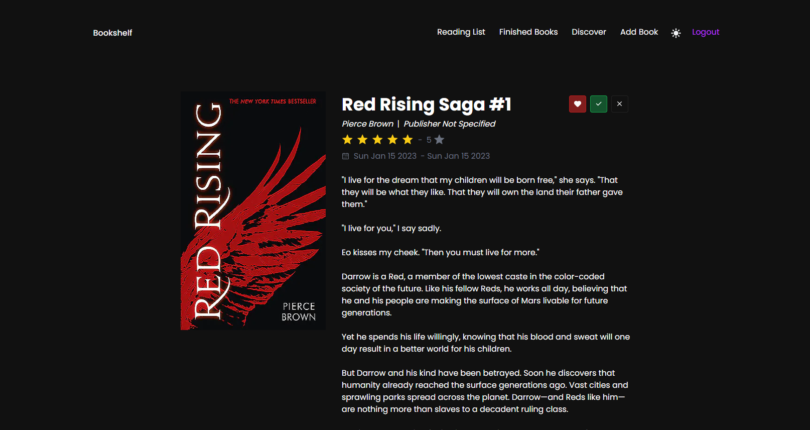

# Bookshelf

Bookshelf is a simple application for managing your books. With it, you can easily keep track of the books you own, the books you've read, and the books you want to read.



## Features

- [x] Add books to your library with title, author, and cover image
- [x] Mark books as read or currently reading
- [x] Create a reading list of books you want to read
- [x] Like and rate books
- [x] View book details including a summary and publication date
- [ ] Move to different database hosting provider (one that doesn't sleep)
- [ ] Update/Delete books from your library
- [ ] Dark/Light Theme
- [ ] Loadings indicators
- [ ] and more ...

## Technology Stack

- [Next.js](https://nextjs.org)
- [NextAuth.js](https://next-auth.js.org)
- [Prisma](https://prisma.io)
- [Tailwind CSS](https://tailwindcss.com)
- [tRPC](https://trpc.io)

## Installation

Clone the repository:

```
git clone https://github.com/rafalmoneta/bookshelf.git
```

Install dependencies:

```
yarn install
```

Create a Postgresql database with Docker

```
docker-compose up -d
```

Setup .env file (use `env.example`) - see NextAuth guides on how to setup Discord and GitHub provider (remember to use the correct callback url)

```
DATABASE_URL=

NEXTAUTH_SECRET=
NEXTAUTH_URL=

DISCORD_CLIENT_ID=
DISCORD_CLIENT_SECRET=

GITHUB_CLIENT_ID=
GITHUB_CLIENT_SECRET=
```

Run migrations

```
yarn prisma migrate
```

Run the application in development:

```
yarn dev
```

Visit http://localhost:3000 in your browser to use the application.

### Contribution

We welcome contributions to the Bookshelf project. If you have an idea for a new feature or have found a bug, please submit an issue or a pull request.
